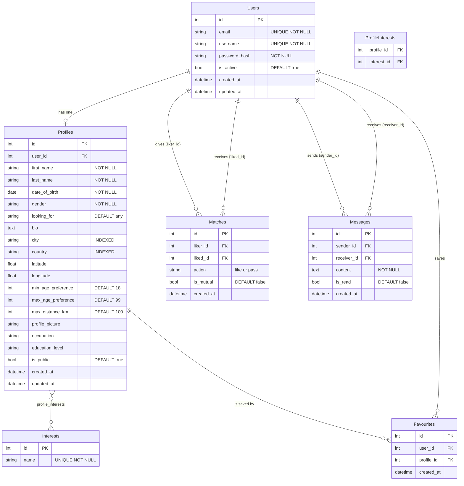

# DriftDater a Dating Application

**INFO3180 Group Project**

DriftDater is a dating application built using Vue 3 for the frontend and Flask for the backend. The aim of this project was to create a simple platform where users can connect, match and communicate with each other.

---

## Team Members and Roles

- Cheyenne Gowie (620149270) - Project Manager - Planning, coordination, and overall structure
- Adrienne Jobs (620172127) - Backend Lead - Flask API, database design, and backend logic
- Akeelia Philbert (620160082) - Frontend Lead - Vue 3 interface, components, and routing
- Shantauna Sibbey (620137399) - QA and Testing Lead - Testing, validation, and documentation
- Brittannia Gregory (620156816) - Deployment Lead - Deployment and configuration

---

## Features

### Core Features

- User Authentication - Register, login, and logout with password hashing
- Profile Management - Create and edit profiles with pictures, bio, and interests
- Smart Matching - Matching based on interests, age, location, and preferences
- Like and Pass System - Mutual likes create confirmed matches
- Messaging - Matched users can send and receive messages
- Search and Filter - Filter profiles by name, location, age, and interests
- Saved Profiles - Bookmark profiles to view later

### Additional Features

- Profile visibility controls (public/private)
- Basic admin functionality
- Deployment on Render
- Dark mode/theme customization
- Video chat integration for matched users
- Report/block user functionality
---

## Technology Stack

- Frontend - Vue 3, Vite, Pinia, Vue Router
- Backend - Flask, SQLAlchemy, Flask-Migrate
- Database - SQLite (development), PostgreSQL (production)
- Authentication - Flask-Login, Flask-Bcrypt
- API - REST with JSON and CORS
- Deployment - Render

---

## Setup Instructions

### Prerequisites

- Python 3.10 or higher
- Node.js 18 or higher
- npm

---

### Deployed Website Link

- https://driftdater-frontend-7s49.onrender.com/

---

### Backend Setup

```bash
cd backend

# Create and activate a virtual environment
python -m venv venv

# on Windows
venv\Scripts\activate

# on macOS / Linux
source venv/bin/activate

# Install the dependencies
pip install -r requirements.txt

# Copy the environment file
cp .env.example .env

# Run database migrations
flask --app app db init
flask --app app db migrate -m "Initial migration"
flask --app app db upgrade

# Seed the database with sample data
python seed.py

# Start the development server
flask --app app --debug run
```

> Backend runs at `http://localhost:5000`

---

### Frontend Setup

```bash
cd frontend

npm install
npm run dev
```

> Frontend runs at `http://localhost:5173`

---

## Test Accounts

The following accounts are available after running `python seed.py`:


- alice@example.com - password123  - Alice Wonder 
- bob@example.com - password123 - Bob Builder 
- grace@example.com - password123 - Grace Gamer 
- carol@example.com - password123 - Carol Cook 
- emma@example.com - password123 - Emma Artist 

---

## API Overview

**Base URL:** `http://localhost:5000/api`

### Authentication

| Method | Endpoint | Description |
|--------|----------|-------------|
| `POST` | `/auth/register` | Register a new user |
| `POST` | `/auth/login` | Log in |
| `POST` | `/auth/logout` | Log out |
| `GET` | `/auth/check` | Check authentication status |
| `GET` | `/auth/me` | Get current user info |

### Profiles

| Method | Endpoint | Description |
|--------|----------|-------------|
| `POST` | `/profiles` | Create a new profile |
| `GET` | `/profiles/me` | Get the current user's profile |
| `PUT` | `/profiles/me` | Update the current user's profile |
| `GET` | `/profiles/{user_id}` | Get a specific user's profile |
| `GET` | `/profiles/browse` | Browse unacted-on profiles |
| `GET` | `/profiles/picture/{filename}` | Serve a profile picture |

### Matches

| Method | Endpoint | Description |
|--------|----------|-------------|
| `POST` | `/matches/action` | Like or pass on a profile |
| `GET` | `/matches/mutual` | Get all mutual matches |
| `GET` | `/matches/count` | Get mutual match count |
| `GET` | `/matches/status/{user_id}` | Get match status with a user |

### Messages

| Method | Endpoint | Description |
|--------|----------|-------------|
| `POST` | `/messages/send` | Send a message |
| `GET` | `/messages/conversation/{user_id}` | Get conversation history |
| `GET` | `/messages/conversations` | Get all conversation summaries |

### Search

| Method | Endpoint | Description |
|--------|----------|-------------|
| `GET` | `/search` | Search profiles with filters |
| `GET` | `/search/interests` | Get all available interests |

### Favourites

| Method | Endpoint | Description |
|--------|----------|-------------|
| `GET` | `/favourites` | Get saved profiles |
| `POST` | `/favourites` | Save a profile |
| `DELETE` | `/favourites/{profile_id}` | Remove a saved profile |
| `GET` | `/favourites/check/{profile_id}` | Check if a profile is saved |

---

## Database Design

### 1. ER Diagram

The diagram below shows all 7 tables, their columns, primary keys, foreign keys, and relationships. Rendered automatically by [Mermaid.js](https://mermaid.js.org/) on GitHub.



---

### 2. Database Schema Documentation

#### Table: `users`

Stores login credentials for every registered account. One row per user.

| Column | Type | Constraints | Description |
|--------|------|-------------|-------------|
| `id` | INTEGER | PK, AUTO INCREMENT | Surrogate primary key |
| `email` | VARCHAR(120) | UNIQUE, NOT NULL, INDEX | Login email address |
| `username` | VARCHAR(80) | UNIQUE, NOT NULL, INDEX | Public display name |
| `password_hash` | VARCHAR(255) | NOT NULL | bcrypt hash — plaintext never stored |
| `is_active` | BOOLEAN | DEFAULT TRUE | Soft-disable flag |
| `created_at` | DATETIME | DEFAULT utcnow | Account creation timestamp |
| `updated_at` | DATETIME | DEFAULT / onupdate | Last modification timestamp |

#### Table: `profiles`

One-to-one extension of `users`. Contains all dating-profile data. Created after registration in the 3-step wizard.

| Column | Type | Constraints | Description |
|--------|------|-------------|-------------|
| `id` | INTEGER | PK, AUTO INCREMENT | Surrogate primary key |
| `user_id` | INTEGER | FK → users.id, UNIQUE, INDEX | Owner — UNIQUE enforces 1:1 relationship |
| `first_name` | VARCHAR(50) | NOT NULL | Given name |
| `last_name` | VARCHAR(50) | NOT NULL | Family name |
| `date_of_birth` | DATE | NOT NULL | Used to compute age at query time |
| `gender` | VARCHAR(20) | NOT NULL | male / female / non-binary / other |
| `looking_for` | VARCHAR(20) | DEFAULT 'any' | Preferred partner gender |
| `bio` | TEXT | NULLABLE | Free-text self description |
| `city` | VARCHAR(100) | INDEX | Used in search and distance scoring |
| `country` | VARCHAR(100) | INDEX | Used in search filtering |
| `latitude` | FLOAT | NULLABLE | GPS coordinate for Haversine distance |
| `longitude` | FLOAT | NULLABLE | GPS coordinate for Haversine distance |
| `min_age_preference` | INTEGER | DEFAULT 18 | Minimum preferred partner age |
| `max_age_preference` | INTEGER | DEFAULT 99 | Maximum preferred partner age |
| `max_distance_km` | INTEGER | DEFAULT 100 | Maximum match distance in km |
| `profile_picture` | VARCHAR(255) | NULLABLE | UUID filename stored in `uploads/` |
| `occupation` | VARCHAR(100) | NULLABLE | Job title or field |
| `education_level` | VARCHAR(50) | NULLABLE | Highest qualification |
| `is_public` | BOOLEAN | DEFAULT TRUE | Visibility toggle |
| `created_at` | DATETIME | DEFAULT utcnow | Profile creation timestamp |
| `updated_at` | DATETIME | DEFAULT / onupdate | Last edit timestamp |

> `age` is never stored it is calculated from `date_of_birth` at query time.

#### Table: `interests`

Lookup / reference table of interest tags. Populated at startup by `seed.py`.

| Column | Type | Constraints | Description |
|--------|------|-------------|-------------|
| `id` | INTEGER | PK, AUTO INCREMENT | Surrogate primary key |
| `name` | VARCHAR(50) | UNIQUE, NOT NULL, INDEX | Interest label e.g. "Hiking" |

#### Table: `profile_interests`

A junction table implementing the many-to-many relationship between `profiles` and `interests`.

| Column | Type | Constraints | Description |
|--------|------|-------------|-------------|
| `profile_id` | INTEGER | PK, FK -> profiles.id CASCADE | Profile side of junction |
| `interest_id` | INTEGER | PK, FK -> interests.id CASCADE | Interest side of junction |

#### Table: `matches`

Records every Like or Pass action between users. `is_mutual = TRUE` when both users have liked each other.

| Column | Type | Constraints | Description |
|--------|------|-------------|-------------|
| `id` | INTEGER | PK, AUTO INCREMENT | Surrogate primary key |
| `liker_id` | INTEGER | FK -> users.id CASCADE, INDEX | User who performed the action |
| `liked_id` | INTEGER | FK -> users.id CASCADE, INDEX | User who was acted on |
| `action` | VARCHAR(10) | NOT NULL | `'like'` or `'pass'` |
| `is_mutual` | BOOLEAN | DEFAULT FALSE | TRUE when both sides liked each other |
| `created_at` | DATETIME | DEFAULT utcnow | Timestamp of action |
| — | — | UNIQUE (liker_id, liked_id) | Prevents duplicate actions between same pair |

#### Table: `messages`

Chat messages between matched users. The API enforces that only mutually-matched users may exchange messages.

| Column | Type | Constraints | Description |
|--------|------|-------------|-------------|
| `id` | INTEGER | PK, AUTO INCREMENT | Surrogate primary key |
| `sender_id` | INTEGER | FK -> users.id CASCADE | Message author |
| `receiver_id` | INTEGER | FK -> users.id CASCADE | Message recipient |
| `content` | TEXT | NOT NULL | Message body |
| `is_read` | BOOLEAN | DEFAULT FALSE | Read-receipt flag |
| `created_at` | DATETIME | DEFAULT utcnow, INDEX | Send timestamp |

#### Table: `favourites`

Allows a user to bookmark profiles for quick access, independent of the match system.

| Column | Type | Constraints | Description |
|--------|------|-------------|-------------|
| `id` | INTEGER | PK, AUTO INCREMENT | Surrogate primary key |
| `user_id` | INTEGER | FK -> users.id CASCADE, INDEX | User who bookmarked |
| `profile_id` | INTEGER | FK -> profiles.id CASCADE | Bookmarked profile |
| `created_at` | DATETIME | DEFAULT utcnow | Bookmark timestamp |
| — | — | UNIQUE (user_id, profile_id) | Prevents duplicate bookmarks |

---

### 3. Normalisation — 3rd Normal Form (3NF)

#### First Normal Form (1NF)
- Every column holds a single atomic value — no comma-delimited lists or arrays stored anywhere.
- The many-to-many interest relationship uses a dedicated `profile_interests` junction table instead of a string column.
- Every table has a well-defined primary key.

#### Second Normal Form (2NF)
- All tables with a single-column surrogate PK automatically satisfy 2NF every non-key column depends on the entire key.
- `profile_interests` has a composite PK `(profile_id, interest_id)` and stores no other columns, so partial dependencies cannot exist.

#### Third Normal Form (3NF)

No non-key column depends on another non-key column (no transitive dependencies):

| Table | Proof of 3NF compliance |
|-------|------------------------|
| `users` | `password_hash`, `is_active`, `created_at` all depend directly on `id`. `email` and `username` are candidate keys, not descriptors of each other. |
| `profiles` | All columns depend solely on `id`. Age is derived from `date_of_birth` at query time never stored, so no update anomaly can occur. |
| `interests` | `name` depends only on `id`. Single non-key column. |
| `profile_interests` | Composite PK only no non-key columns exist to create transitive dependencies. |
| `matches` | `action`, `is_mutual`, `created_at` all depend on `id`. `liker_id` and `liked_id` are FK references, not descriptive attributes of each other. |
| `messages` | `content`, `is_read`, `created_at` all depend on `id`. |
| `favourites` | `created_at` depends on `id`. `user_id` and `profile_id` are FK references only. |

---

### 4. Indexes on Appropriate Columns

Indexes are applied to columns used in `WHERE`, `JOIN`, or `ORDER BY` on high-frequency queries. Over-indexing degrades write performance, so only justified indexes are included.

| Index Name | Table | Column(s) | Type | Justification |
|------------|-------|-----------|------|---------------|
| `ix_users_email` | `users` | `email` | UNIQUE B-Tree | Login lookup runs on every login request |
| `ix_users_name` | `users` | `username` | UNIQUE B-Tree | Unique constraint + display-name lookup |
| `ix_profiles_user_id` | `profiles` | `user_id` | UNIQUE B-Tree | FK join profile always fetched via user_id |
| `ix_profiles_city` | `profiles` | `city` | B-Tree | Search and filter by city |
| `ix_profiles_country` | `profiles` | `country` | B-Tree | Search and filter by country |
| `ix_interests_name` | `interests` | `name` | UNIQUE B-Tree | Tag lookup during seeding and search |
| `idx_liker` | `matches` | `liker_id` | B-Tree | Find all actions a user has taken |
| `idx_liked` | `matches` | `liked_id` | B-Tree | Find all likes received mutual match detection |
| `ix_favourites_user_id` | `favourites` | `user_id` | B-Tree | Fetch all bookmarks for a user |
| `idx_conversation` | `messages` | `(sender_id, receiver_id)` | Composite B-Tree | Load full conversation between two users |
| `ix_messages_created_at` | `messages` | `created_at` | B-Tree | Sort messages chronologically |

---

### 5. Migration Scripts

DriftDater uses **Flask-Migrate** (Alembic) for schema versioning. Every schema change is tracked as a versioned migration file under `backend/migrations/versions/`.

#### Flask-Migrate Commands

```bash
# First time only — initialise the migrations folder
flask --app app db init

# Auto-generate a migration from current SQLAlchemy models
flask --app app db migrate -m "Initial schema"

# Apply all pending migrations to the database
flask --app app db upgrade

# Roll back the most recent migration if needed
flask --app app db downgrade
```

#### Raw SQL Schema (portable fallback)

The following SQL reproduces the full schema on either SQLite or PostgreSQL:

```sql
-- DriftDater Full Schema Migration
-- Compatible with SQLite 3.x and PostgreSQL 13+

CREATE TABLE IF NOT EXISTS Users (
    id INTEGER PRIMARY KEY AUTOINCREMENT,
    email VARCHAR(120) NOT NULL UNIQUE,
    username VARCHAR(80) NOT NULL UNIQUE,
    password_hash VARCHAR(255) NOT NULL,
    is_active BOOLEAN NOT NULL DEFAULT 1,
    created_at DATETIME DEFAULT CURRENT_TIMESTAMP,
    updated_at DATETIME DEFAULT CURRENT_TIMESTAMP
);

CREATE INDEX IF NOT EXISTS ix_users_email ON Users(email);
CREATE INDEX IF NOT EXISTS ix_users_name ON Users(username);

CREATE TABLE IF NOT EXISTS Profiles (
    id INTEGER PRIMARY KEY AUTOINCREMENT,
    user_id INTEGER NOT NULL UNIQUE REFERENCES Users(id) ON DELETE CASCADE,
    first_name VARCHAR(50) NOT NULL,
    last_name VARCHAR(50) NOT NULL,
    date_of_birth DATE NOT NULL,
    gender VARCHAR(20) NOT NULL,
    looking_for VARCHAR(20) DEFAULT 'any',
    bio TEXT,
    city VARCHAR(100),
    country VARCHAR(100),
    latitude REAL,
    longitude REAL,
    min_age_preference INTEGER DEFAULT 18,
    max_age_preference INTEGER DEFAULT 99,
    max_distance_km INTEGER DEFAULT 100,
    profile_picture VARCHAR(255),
    occupation VARCHAR(100),
    education_level VARCHAR(50),
    is_public BOOLEAN NOT NULL DEFAULT 1,
    created_at DATETIME DEFAULT CURRENT_TIMESTAMP,
    updated_at DATETIME DEFAULT CURRENT_TIMESTAMP
);

CREATE INDEX IF NOT EXISTS ix_profiles_user_id ON Profiles(user_id);
CREATE INDEX IF NOT EXISTS ix_profiles_city ON Profiles(city);
CREATE INDEX IF NOT EXISTS ix_profiles_country ON Profiles(country);

CREATE TABLE IF NOT EXISTS Interests (
    id INTEGER PRIMARY KEY AUTOINCREMENT,
    name VARCHAR(50) NOT NULL UNIQUE
);

CREATE INDEX IF NOT EXISTS ix_interests_name ON Interests(name);

CREATE TABLE IF NOT EXISTS ProfileInterests (
    profile_id INTEGER NOT NULL REFERENCES Profiles(id) ON DELETE CASCADE,
    interest_id INTEGER NOT NULL REFERENCES Interests(id) ON DELETE CASCADE,
    PRIMARY KEY (profile_id, interest_id)
);

CREATE TABLE IF NOT EXISTS Matches (
    id INTEGER PRIMARY KEY AUTOINCREMENT,
    liker_id INTEGER NOT NULL REFERENCES Users(id) ON DELETE CASCADE,
    liked_id INTEGER NOT NULL REFERENCES Users(id) ON DELETE CASCADE,
    action VARCHAR(10) NOT NULL CHECK(action IN ('like','pass')),
    is_mutual BOOLEAN NOT NULL DEFAULT 0,
    created_at DATETIME DEFAULT CURRENT_TIMESTAMP,
    UNIQUE(liker_id, liked_id)
);

CREATE INDEX IF NOT EXISTS idx_liker ON Matches(liker_id);
CREATE INDEX IF NOT EXISTS idx_liked ON Matches(liked_id);

CREATE TABLE IF NOT EXISTS Messages (
    id INTEGER PRIMARY KEY AUTOINCREMENT,
    sender_id INTEGER NOT NULL REFERENCES Users(id) ON DELETE CASCADE,
    receiver_id INTEGER NOT NULL REFERENCES Users(id) ON DELETE CASCADE,
    content TEXT NOT NULL,
    is_read BOOLEAN NOT NULL DEFAULT 0,
    created_at DATETIME DEFAULT CURRENT_TIMESTAMP
);

CREATE INDEX IF NOT EXISTS idx_conversation ON Messages(sender_id, receiver_id);
CREATE INDEX IF NOT EXISTS ix_messages_created_at ON Messages(created_at);

CREATE TABLE IF NOT EXISTS Favourites (
    id INTEGER PRIMARY KEY AUTOINCREMENT,
    user_id INTEGER NOT NULL REFERENCES Users(id) ON DELETE CASCADE,
    profile_id INTEGER NOT NULL REFERENCES Profiles(id) ON DELETE CASCADE,
    created_at DATETIME DEFAULT CURRENT_TIMESTAMP,
    UNIQUE(user_id, profile_id)
);

CREATE INDEX IF NOT EXISTS ix_favourites_user_id ON Favourites(user_id);
```

---

## Security

- Passwords are hashed using **bcrypt**
- Authentication is handled with **Flask-Login**
- CORS is configured to allow only the frontend origin
- All endpoints include input validation
- SQL injection is prevented through the **SQLAlchemy ORM**
- Sensitive configuration is stored in a `.env` file and excluded from version control

---

## Known Issues

- Messaging uses polling every 3 seconds rather than a real-time WebSocket connection
- No email verification is performed on registration
- Profile images are stored locally and should use cloud storage in production
- SQLite is used in development only but PostgreSQL is required for production

---

## References

- [Flask Documentation](https://flask.palletsprojects.com/)
- [Vue 3 Documentation](https://vuejs.org/)
- [Pinia Documentation](https://pinia.vuejs.org/)
- [Vue Router Documentation](https://router.vuejs.org/)
- [SQLAlchemy Documentation](https://docs.sqlalchemy.org/)
- [Flask-Login Documentation](https://flask-login.readthedocs.io/)
